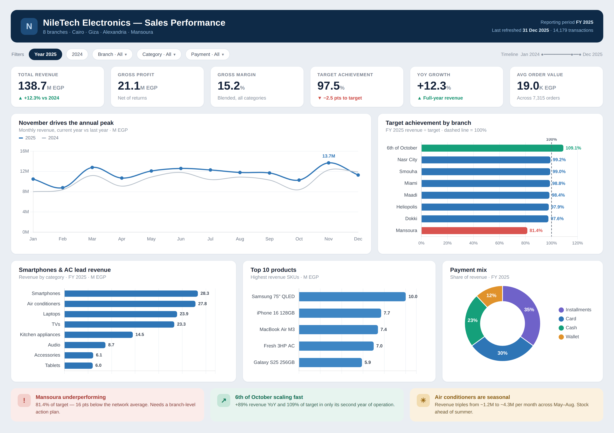

# NileTech Electronics — Retail Sales Performance Dashboard

An end-to-end retail analytics dashboard built entirely in **Microsoft Excel**, using **Power Query** for data cleaning, **Power Pivot (Data Model + DAX)** for modeling, and **PivotCharts + slicers** for an interactive reporting layer.

The project takes five raw, messy CSV files and turns them into a single interactive dashboard that answers the questions a retail leadership team actually asks: *How are we tracking against target? Which branches, categories, and products drive revenue and profit? What are the seasonal patterns?*



---

## 📌 Business problem

*NileTech Electronics* is a (fictional) electronics retailer operating **8 branches** across Cairo, Giza, Alexandria, and Mansoura. Management needed one place to monitor full-year performance against branch targets, understand category and product mix, and spot seasonal demand — without manually stitching spreadsheets together each month.

## 🗂️ The data

Five source files covering **2024–2025** (~14,000 transactions):

| File | Description |
|------|-------------|
| `sales_2024.csv` / `sales_2025.csv` | Transaction-level order lines |
| `products.csv` | 55 products across 8 categories, with list price & unit cost |
| `branches.csv` | Branch directory (city, opening date) |
| `monthly_targets.csv` | Revenue targets at branch × month grain |

The raw data was intentionally messy. As part of the build I resolved:

- Dates stored as **text** in `dd/mm/yyyy` format (locale-aware conversion)
- **Inconsistent branch names** (casing and trailing spaces, e.g. `"NASR CITY"`, `"Dokki "`)
- **Inconsistent payment values** (`cash`/`CASH`, `Visa/Mastercard` vs `Credit Card`)
- **Duplicate rows** in the 2025 file
- **Missing unit prices** (filled from the product list price via a merge)
- **Zero-quantity** data-entry errors
- **Returns** stored as negative quantities (flagged and kept so revenue nets correctly)
- **Blank customer IDs** for walk-in customers

## 🔧 Approach

1. **Power Query** — imported and appended the two sales files, then cleaned every issue above and engineered `line_revenue`, a `transaction_type` flag, and a target-join key. Loaded all tables to the Data Model (connection-only).
2. **Power Pivot data model** — built a star schema relating sales to products, branches, a dedicated date table, and the monthly targets.
3. **DAX measures** — 12 measures including `Total Revenue`, `Gross Profit`, `Margin %`, `Target Achievement %`, and `YoY Growth %` (time intelligence via `SAMEPERIODLASTYEAR`).
4. **Dashboard** — six KPI cards, a monthly revenue trend (current vs prior year), a branch-vs-target ranking, category and top-product breakdowns, and a payment-mix doughnut, all driven by **slicers + a timeline** so the whole board filters with one click.

## 📈 Key insights

- **Revenue grew ~12% YoY**, from ~123.5M to **~138.7M EGP**.
- **Mansoura is the only branch missing target** — **81.4%** vs a ~97–99% network average — flagging it for a branch-level action plan.
- **6th of October**, the newest branch, hit **109% of target** with **~89% revenue growth** in its second year.
- **Air-conditioner demand is highly seasonal** — revenue roughly **triples** in May–August, an inventory-planning signal.
- **Margin vs volume tension:** accessories are the **highest-margin** category (~33%) but lowest revenue, while laptops are high-revenue, **low-margin** (~13%).

## 🛠️ Tech stack

`Excel` · `Power Query (M)` · `Power Pivot` · `DAX` · `PivotCharts` · `Slicers`

## 📁 Repository structure

```
.
├── NileTech_Dashboard.xlsm     # The interactive workbook (Data Model + DAX + slicers)
├── data/                       # Raw source CSVs
├── images/                     # Dashboard screenshot
├── docs/                       # Step-by-step build guide (PDF)
└── README.md
```

## ▶️ How to use

1. Download `NileTech_Dashboard.xlsm` and open it in **Excel for Windows** (the Data Model, DAX, and Timeline slicer require Windows).
2. Enable content if prompted, then use the slicers and timeline at the top to filter by year, branch, category, payment method, or date.
3. To rebuild from scratch, the raw data is in `/data` and a full walkthrough is in `/docs/Build_Guide.pdf`.

> **Note:** the dataset is synthetic and was generated for portfolio purposes; it does not represent a real company.

---

### 👤 Author

**Ahmed Jubran** — Data Analyst (SQL · Power BI · Excel · Python)
📍 Giza, Egypt
